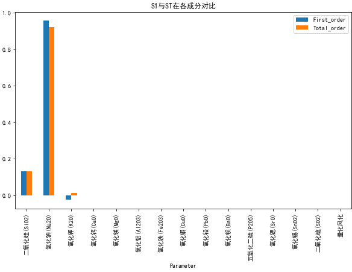

[(10条消息) python进行敏感性分析（SALib库)_bujbujbiu的博客-CSDN博客_python 敏感性分析](https://blog.csdn.net/weixin_45526117/article/details/124807542#:~:text=SALib是一个基于python进行敏感性分析的开源库，SALib提供一个解耦的工作流，意味着它不直接与数学或计算模型交互，SALib 负责使用其中一个采样函数（sample,functions）生成模型输入，并使用其中一个分析函数（analyze functions）计算模型输出的灵敏度指数。)

- 一阶指数：度量单个模型输入对输出方差的贡献
- 二阶指数：度量两个模型输入的相互作用对输出方差的贡献
- 总阶指数：度量模型输入对输出方差的贡献，包括一阶及更高阶

[敏感度分析 - 维基百科，自由的百科全书 (wikipedia.org)](https://zh.wikipedia.org/wiki/敏感度分析):维基的解释

[Python中的模型敏感度分析(使用Salib) - 知乎 (zhihu.com)](https://zhuanlan.zhihu.com/p/137953265)：

输出结果的一般形式：Si是一个字典，含有"S1"， "S2"，"ST"，"S1_conf"，"S2_conf"，和 "ST_conf"项目。

其中"S1"， "S2"，"ST" 分别表示一阶灵敏度，二阶灵敏度和总灵敏度。（一个二阶灵敏度会涉及两个变量）, 而对应他们名字加上_conf 则表示对应的置信度（95%）。

灵敏度分析结果出现负数，说明灵敏度很小，并且因为样本太小所以出现了一些统计误差。

[PCSE/WOFOST教程---10.敏感性分析 - 知乎 (zhihu.com)](https://zhuanlan.zhihu.com/p/478027175)

绘制了具有一阶和总阶敏感度的图表。参数的一阶灵敏度指数表示由输入参数变化引起的目标变量方差的比例。总阶指数表示给定参数的目标变量中的总方差，包括由其与任何其他输入变量的任何阶的相互作用引起的所有方差。

在许多模型中，模型的参数或物理约束之间存在统计相关性。在这种情况下，输出中的部分方差也是由变量之间的相互作用引起的，这些变量没有由一阶索引表示。在这种情况下，需要计算二阶指数。如果总阶指数远大于一阶指数，那么很可能发生了更高阶的相互作用。这意味着如果两个参数同时改变，将对目标变量产生很大的影响。

请注意，指数不一定都得加在一起，而且由于抽样误差，指数通常会变得略微负数。如果增加样本数量，这种负指数值就会消失。

二阶灵敏度处理两个参数的组合灵敏度。因此，结果可以通过矩阵最容易地可视化。

通过图像以图形方式显示矩阵值中的值。从结果中可以清楚地看出，二阶交互作用很小，**因为所有指数的值都 < 0.04**。

## 敏感度分析

使用python中的Salib进行敏感度分析，我们计算原本数据集中每个特征的最大值和最小值作为边界，进而采样生成32000个特征向量进行预测，最后根据预测结果进行敏感度评估计算。

通过以下三个指标进行分析：
$$
\left\{
\begin{array}{l}
一阶敏感度S1：度量单变量输入对输出方差的影响贡献度      \\
二阶敏感度S2：度量两个变量输入相互作用对输出方差的贡献		\\
总阶敏感度ST：度量模型输入对输出方差的贡献，在一阶，二阶乃至更高阶都有计算
\end{array} \right.
$$

一阶灵敏度表示由输入的一个参数变化引起的目标变量方差变化的比例。总阶指数表示给定参数的目标变量中的总方差，包括由其与任何其他输入变量的任何阶的相互作用引起的所有方差。下图为一阶灵敏度$S1$与$ST$在各个成分上的对比，通过柱状图分析，我们可以明显观察到可以看到，成分$SiO_2$和成分$Na_2O$都表现出了一阶灵敏性，成分$K_2O$还出现的了负数的情况，是由于样本数量较少，存在抽样误差，导致指标为负数。

计算$SiO_2,Na_2O,K_2O$之间的交互作用：

$$
\left\{
\begin{array}{rcl}
SiO_2-Na_2O = -0.021632681100776097      \\
SiO_2-K_2O =	0.030570028332032845		\\
Na_2O-K_2O =-0.04295463009829131
\end{array} \right.
$$

$SiO_2-Na_2O$以及$Na_2O-K_2O$的指数都小于0，说明随着样本数量的增加，它们的误差会不断减小。$SiO_2-K_2O$的指标为正，说明两者之间具有较强的关联性，会出现计算误差。

二阶灵敏度表示处理两个参数组合下的灵敏度变换，故此通过热力图进行可视化分析，我们可以发现二阶交互作用很小，所有指数的值都小于0.04，

